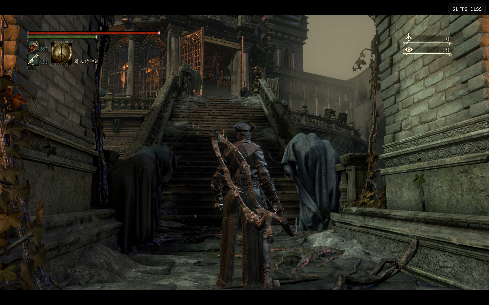
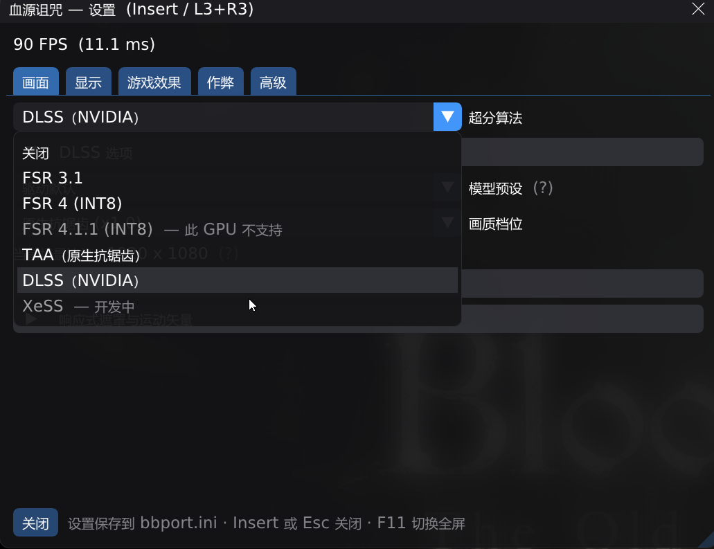

[English](README.md) · [简体中文](README.zh.md)

# bbport — a native PC port of Bloodborne

bbport runs the official PlayStation 4 executable of *Bloodborne* directly on x86-64 PCs. It is not a general-purpose emulator: the game's own x86-64 code executes natively, a small runtime written for this one title replaces the PS4 system libraries, and the GPU side is derived from the [shadPS4](https://github.com/shadps4-emu/shadPS4) rendering core with deep game-specific extensions. No CPU emulation, no per-instruction translation — the game runs at full speed.

The `windows-port` branch is the native Windows version; it adds NVIDIA DLSS upscaling, an in-game cheat engine, full gamepad support and Chinese text on top of the original Linux version.




## Disclaimer

- This project is for learning and technical research only. Commercial use is prohibited.
- The repository distributes **no game files, no game assets, no artwork, no fonts and no decryption keys**. You must supply a legally obtained dump of your own copy of *Bloodborne* (digital version, patch 1.09).
- This project is not affiliated with Sony Interactive Entertainment or FromSoftware. *Bloodborne* and all related trademarks belong to their respective owners.
- Community patches and cheat files are **not bundled** — `patches\Bloodborne.xml` (required to start) is the only one you must supply yourself; get it and the rest from their original authors (see *Mods and patches* below) and review their contents before enabling.
- Use of this project is at your own risk; the authors are not responsible for any consequences.

## Status

Experimental but playable. The game boots, combat works, saving works; audio, gamepads and saves are verified, the full game has not been completed end to end. Verified on NVIDIA RTX 40-series GPUs at 1080p/1440p output. AMD GPUs use the FSR path; FSR 4.1.1 currently requires the RADV driver.

## Features

- Native execution. The eboot is converted offline into a flat memory image; PS4 libc and libSceFios2 are linked in as native code. The loader and runtime are about five thousand lines of C.
- Frame-rate unlock. Community patches make the emulator honor real frame times; 30/60/90 FPS caps are also available.
- Temporal upscaling designed for *Bloodborne*. The game has no motion buffers, so bbport computes motion vectors itself: camera motion from depth and scene matrices, object motion from previous-frame vertex positions. The scene is rendered at a lower resolution with Halton-sequence sub-pixel jitter; the UI is drawn natively at output resolution.
  - DLSS — the best option on NVIDIA RTX cards. Requires `nvngx_dlss.dll` next to the executable or in `BB_DLSS_DIR`. The DLL is not distributed with this repository.
  - FSR 3.1 (FireBurn/FSR-Vulkan).
  - FSR 4 INT8 and FSR 4.1.1 INT8 — require Float16, Int8/Int16 and integer dot-product Vulkan features; falls back to FSR 3.1 automatically at startup when unsupported.
  - TAA — native-resolution temporal anti-aliasing, hot-swappable with FSR; the sharpness slider applies to both.
- Multithreaded GPU command processing. The command stream is decoded on one thread while another thread binds resources and records draws — a two-stage pipeline that scales with hardware threads, with a no-progress watchdog.
- In-game menu: open with Insert or L3+R3. Upscaling, presets, sharpness, output resolution, picture effects, free camera and a cheats page.
- Cheat engine: reads GoldHEN and shadPS4 JSON cheat files directly, writes memory natively; the game's code-cave patches work as-is.
- Mod support: loose-file directories override original files in load order; the original game is never modified.

## Requirements

- Windows 10 1803 or newer 64-bit, or Linux x86-64.
- A Vulkan 1.3 GPU. DLSS needs an NVIDIA RTX card; FSR 4/4.1.1 need the shader features listed above (4.1.1 additionally `VK_VALVE_shader_mixed_float_dot_product`).
- Game directory: a 1.09 dump of any region, containing `eboot.bin` and `sce_module` — e.g. CUSA03173, CUSA03023, CUSA00900.
- Community patch XML for frame-rate unlock and render-resolution presets (see *Mods and patches*) — required, the launch fails without one.

## Quick start (Windows)

Option 1 — one-click setup (recommended). Double-click `setup.bat`: a window opens where you pick the game directory and settings, then Install/Update installs MSYS2 and all packages, builds, and generates `bbport.ini` plus shortcuts. Run it again any time to change settings; Save settings stores them without building.

**Two things the installer does not do for you.** Do them first, or the port fails at launch with a
"community patch database is missing" error:

1. The game directory: a 1.09 dump of any region (with `eboot.bin` and `sce_module`).
2. The community patch database `patches\Bloodborne.xml` — see *Mods and patches*. The repository
   does not redistribute it and the copyright is not the port's to give.

Option 2 — manual, three pasted commands.

1. Install [MSYS2](https://www.msys2.org) with the installer defaults (`C:\msys64`; if you change it, also set the `BB_MSYS2` user environment variable).
2. Paste this single line into plain cmd or PowerShell — do not open any MSYS2 shell, the script picks the right environment:

   ```
   C:\msys64\usr\bin\bash.exe -lc "pacman -S --needed git mingw-w64-clang-x86_64-{clang,lld,libc++,cmake,ninja,pkgconf,python,sdl3,boost,fmt,glslang,spirv-cross,spirv-headers,vulkan-headers,vulkan-loader,vulkan-memory-allocator,xxhash,zydis,robin-map,ffmpeg}"
   ```

3. Clone this repository with any git client, then double-click:

   ```
   run.bat --game-dir D:\Games\CUSA03023
   ```

Building and running are separate: `build.bat` only builds (`scripts/build_windows.py`); `run.bat` starts the game directly and never waits for a build. On first launch `run.bat` asks for the game directory and remembers it in `out\game_dir.txt`; afterwards a plain double-click starts the game. If sources changed, `run.bat` starts with the existing binary immediately and rebuilds in the background at low priority — the next launch picks it up.

`run.bat` calls `scripts\run_windows.py`: it prepares the game image, links modules, compiles patches, assembles the merged mod directory, then starts the game. Saves live in `user\`, mods in `mods\`, patch XML in `patches\`, all under the data directory.

For an AI-assisted setup (a checklist an AI assistant can follow to configure every path), see [docs/AI-SETUP.md](docs/AI-SETUP.md).

## Configuration (bbport.ini)

`bbport.ini` sits in the repository root, `key = value` format, `#` starts a comment. Same-named environment variables take precedence.

- language: PS4 system language reported to the game. 11 = Simplified Chinese, 10 = Traditional Chinese, 1 = English (US). The 1.09 dump ships official Chinese text; no mod needed.
- pad_swap: 1 swaps A/B and X/Y for pads that report the Nintendo layout (e.g. Flydigi in Switch mode); 0 keeps standard mapping.
- gc_budget_mb: texture cache budget in MiB, 0 = automatic. Automatic follows the driver's live budget (`VK_EXT_memory_budget`, already net of the driver's own reservations, shrinking when other processes take VRAM); thresholds sit at 70% / 85% / 95% of it. Cap 16384. Raise it if memory keeps hovering at the critical mark and evicting.
- present_mode: `mailbox` (default, low latency), `fifo` (forced VSync), `immediate` (no sync). Env: `BB_PRESENT_MODE`.
- fullscreen: 1 = borderless fullscreen, same as F11 in-game.
- output_res: output resolution, e.g. 3840x2160; combined with preset it drives the render-resolution patch.
- preset: upscaling preset, determines internal render resolution.
- live_resolution: 0, 1 or auto. 1 keeps the game rendering at 1080p internally and scales render targets at runtime — output and preset changes without restart, at higher load; auto enables it only on discrete GPUs with more than 8 GB; 1080p output and TAA always use the live path.

## Paths

Everything user-specific is pointed at, never bundled:

| What                                  | Where                                          | Override                    |
|---------------------------------------|------------------------------------------------|-----------------------------|
| Game dump (eboot.bin, sce_module)     | any location, remembered in `out\game_dir.txt` | `--game-dir`, `BB_GAME_DIR` |
| Patch XML (shadPS4 format)            | `patches\`                                     | `BB_PATCHES_DIR`            |
| Mods (one subdirectory each)          | `mods\`                                        | `BB_MODS_DIR`               |
| Cheat JSON (GoldHEN / shadPS4 format) | `cheats\`                                      | `BB_CHEATS_DIR`             |
| Saves                                 | `user\`                                        | `BB_USER_DIR`               |
| nvngx_dlss.dll                        | next to the executable                         | `BB_DLSS_DIR`               |
| FSR 4.1.1 assets                      | `fsr4_411\`                                    | `BB_FSR411_DIR`             |
| Settings                              | `bbport.ini`                                   | `BB_CONFIG`                 |

## In-game controls

- Insert or L3+R3: bbport menu — upscaling, sharpness, effects, cheats; some changes need Apply and restart.
- F11: borderless fullscreen toggle.
- Free camera: enabled via the menu (restart needed). Hold Cross and press L3 to switch modes; on keyboard hold Space and press Z. Mutually exclusive with Enemy Control.
- Debug menu: put `DbgFont14h.ccm` and `DbgFont14h.tpf` from your dump's extra data into the game's `dvdroot_ps4\font\`, enable it in the menu and restart; left touchpad or Tab opens it, Backspace acts as right touchpad.

## Cheats

GoldHEN and shadPS4 Qt cheat JSON files are used directly: fields `name`, `id`, `version`, `process`, `mods`; offsets are relative to the eboot module base. Directory resolution order:

1. `BB_CHEATS_DIR` environment variable.
2. `cheats\` next to `bbport.ini`.
3. `cheats\` in the current working directory.

Rules: files whose `process` is not `eboot.bin` or whose `id` mismatches the game serial are silently filtered; version mismatches are logged with the reason; one-way entries without an off-patch show as disabled in the menu; toggle state persists to `state.txt` in the cheats directory; `master` is an opt-in master switch. A bundled sample, `cheats/CUSA03023_01.09_shadPS4.json`, comes from the [GoldHEN Cheat Repository](https://github.com/GoldHEN/GoldHEN_Cheat_Repository) (GPL-3.0); credits are inside the file.

## Mods and patches

- Mods: each subdirectory of `mods\` is one mod, containing `dvdroot_ps4\`, a single wrapper directory, or game directories like `chr\` directly. Filenames are case-insensitive; later loads override earlier ones. To enable/disable or reorder mods, edit `mods.json` in the data directory (`{"order": [...], "disabled": [...]}`); new folders are enabled automatically. Details in [docs/MODS.md](docs/MODS.md).
- Patches: shadPS4-format XML placed in `patches\` is compiled into `patches.bin` at launch. Frame-rate unlock, render resolution and effect toggles all go through this channel.
- **The patch database is not distributed here and is required.** `patches\Bloodborne.xml` is community patch data whose authors (Kyo, illusion, auser1337, emoose, ...) granted no redistribution rights, and its upstream (`shadps4-emu/ps4_cheats`) carries no LICENSE. The port will not start without it — `patches.py` names the file and where to get it when it is missing. Fetch the Bloodborne 1.09 XML from a community patch collection (e.g. the [GoldHEN](https://github.com/GoldHEN) patch collection) into `patches\`.
- **`tools/fetch_patches.sh` downloads upstream's copy as a starting point** — but upstream is missing patch names this port looks up (`Skip Intro`, `Disable Motion Blur (perf increase)`), so the script validates what it fetched and **refuses to install a file the port cannot use**. A rejection means "upstream is not sufficient", not "the download failed".
- **Other community patches are not distributed in this repository.** Anything else you drop into `patches\` is outside version control.

## Useful environment variables

Environment variables take precedence over `bbport.ini`; in most cases editing the file is enough.

- `BB_GAME_DIR` game directory; `BB_MSYS2` MSYS2 location (also readable from the user environment registry for background builds).
- `BB_LANGUAGE`, `BB_PAD_SWAP`, `BB_GC_BUDGET_MB`, `BB_PRESENT_MODE`: mirror the same-named ini keys.
- `BB_DRAW_PIPE=0`: disable the two-stage draw pipeline (single-threaded GPU path), for rendering troubleshooting.
- `BB_PIPE_TIMEOUT_S`: draw-recording watchdog seconds, default 120, 0 disables.
- `BB_UPSCALER=none`: disable temporal upscaling.
- `BB_FRAME_STATS=1` frame statistics; `BB_GPU_PROFILE=1` per-pass GPU timings; `BB_FSR4_PROFILE=1` FSR 4 per-pass timings.
- `BB_FRAMES_AHEAD`: frames the GPU command thread runs ahead, default 1, 0 unlimited.
- `BB_LIVE_RES=1`: live resolution switching.
- `BB_DLSS_DIR`: search directory for nvngx_dlss.dll.
- `BB_CHEATS_DIR`, `BB_DATA_DIR`, `BB_CONFIG`, `BB_USER_DIR`, `BB_MODS_DIR`, `BB_PATCHES_DIR`: relocate the corresponding data locations.
- `BB_VK_VALIDATION=1`: enable Vulkan core validation (development tool; costs performance).

## Troubleshooting

- Device lost at submit with `memory pressure` lines showing `0 images evicted`: the streaming texture working set exceeds the budget — raise `gc_budget_mb`.
- Frozen window: the watchdog terminates with an error after `BB_PIPE_TIMEOUT_S` seconds instead of hanging forever; the log shows StallFatal.
- When `run.bat` fails the window stays open so the error is visible. If the MSYS2 Python is missing, install MSYS2 or set `BB_MSYS2` — note environment variables only reach new processes.
- Chinese text not showing: check `language = 11` and a 1.09 dump.
- Gamepad buttons swapped: `pad_swap = 1`.
- Rendering glitches: retry with `BB_DRAW_PIPE=0`; if still broken, `BB_UPSCALER=none` rules out the upscaler.

## Linux version

The original Linux version remains supported:

```
bash build.sh
BB_GAME_DIR=/path/to/CUSA03173 bash run.sh
```

GTK4 launcher, AppImage packaging and Steam Deck details in `launcher\`, `packaging\` and `docs\`.

## Repository layout

- `src\`: the loader (probe.c) and HLE runtime (runtime_*.c); Windows-specific code in win32_*.c and host_sync.h.
- `scripts\`: offline game-image preparation, module linking, the patch compiler, and the Windows launcher run_windows.py.
- `gpu\`: the rendering library — vendored shadPS4 video core plus this project's changes: ImGui menu, DLSS/FSR, two-stage draw pipeline, frame capture.
- `patches\`: the community patch XML directory. You must supply `Bloodborne.xml` yourself (not in version control); the launcher also reads your other XML from here.
- `tools\`: development and measurement tools.
- `tests\`: loader, runtime, patch and rendering tests — `bash build.sh --test`.
- `documents\`: Chinese-language docs — design review, quality review, developer guide.
- `docs\`: design notes and measurements, including upscaling, parallel GPU, motion vectors and changelogs.

## License and acknowledgements

bbport is licensed under GNU GPL v2 or later and contains GPL-2.0-or-later code from shadPS4. Third-party components keep their own licenses: shadPS4 video core and shader recompiler, sirit (BSD-3-Clause), half (MIT), FireBurn's FSR-Vulkan (MIT), AMD FidelityFX SDK (MIT), LibAtrac9 (MIT), Dear ImGui (MIT), DejaVu fonts (DejaVu license), dxil-spirv (MIT, used to build FSR 4.1.1 assets). The cheat sample derives from the GoldHEN Cheat Repository (GPL-3.0). AMD's FSR 4 DLL and model data, NVIDIA's DLSS DLL, game patches and any game content are not distributed with this repository.

The original Linux port and its community mirrors live at [yumlevi/bloodborne_pc](https://github.com/yumlevi/bloodborne_pc) and [deadinside28/bloodborne_pc](https://github.com/deadinside28/bloodborne_pc) — thanks to everyone who tested, debugged and shared feedback there. The shadPS4 team's renderer is the foundation of the GPU side; the community patch and cheat repositories make the frame-rate unlock and cheats possible.
